````markdown
# Project Overview

The **LCA Supply Chain Database** is a PostgreSQL-based data system for modelling product life cycles using Life Cycle Assessment data. It represents industrial supply chains as a graph of processes, flows, and exchanges, then layers environmental impact results on top so users can query how materials, emissions, resources, and impacts move through a product system.

The project currently supports local seed data and an ELCD 3.2 ingestion pipeline using an openLCA ILCD export.

## 1. Problem Statement

Life Cycle Assessment data is complex because it describes not just individual products, but entire chains of industrial activity.

A single product, such as wheat flour, depends on many upstream processes:

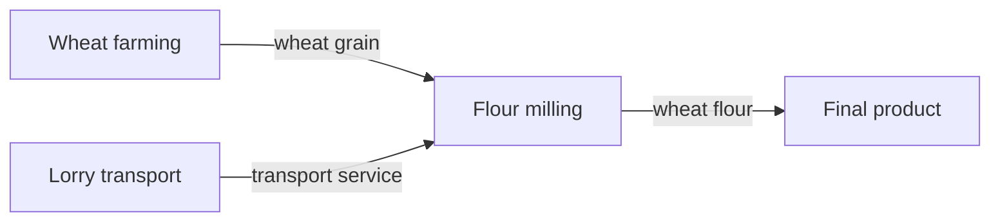

Each process consumes inputs, produces outputs, and may emit substances to air, water, or soil. Traditional flat files or ad hoc spreadsheets make it difficult to answer questions like:

- What are all the inputs and outputs for a process?
- Which upstream processes supply a product input?
- Which emissions cross the boundary between industry and nature?
- What is the cradle-to-gate inventory for a product?
- Which processes contribute most to climate change, acidification, or energy demand?
- Can real external LCA datasets be loaded into a queryable relational model?

The central problem is that LCA data is both **relational** and **graph-like**. Processes connect to flows, flows connect processes to other processes, and elementary flows connect the industrial system to the environment. The project solves this by giving that structure a clean database model and a repeatable data pipeline.

## 2. How The Project Solves the Problem

The project models a life cycle inventory as a graph inside PostgreSQL.

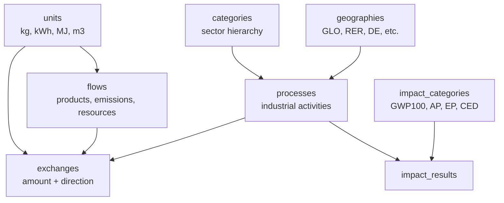

The key idea is:

- **Processes are nodes**: farming, transport, milling, electricity generation, chemical production.
- **Flows are things that move**: wheat grain, electricity, CO2, ammonia, water, waste.
- **Exchanges are edges**: a process consumes or produces a flow in a specific amount.
- **Reference flows define the functional unit**: for example, "1 kg wheat flour" is the main output that other amounts are relative to.
- **Impact results store environmental scores**: pre-calculated LCIA values per process and impact category.

This structure allows both ordinary SQL joins and graph-style recursive queries. For example, a query can start at flour milling, find all product inputs, resolve which upstream process supplies each product, and recursively walk the supply chain.

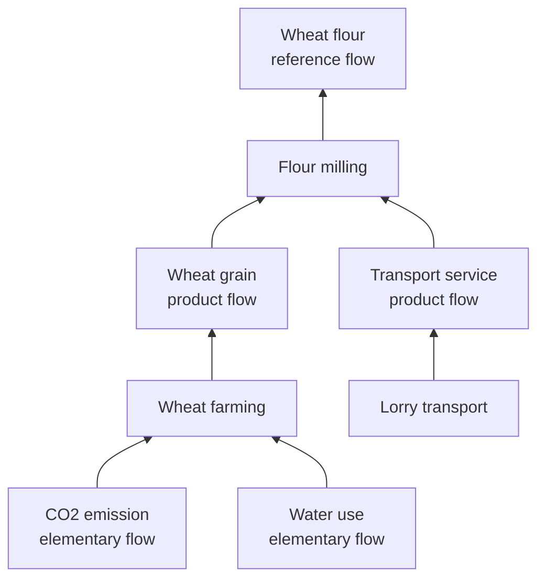

The project also includes a real-data ingestion pipeline for ELCD 3.2:

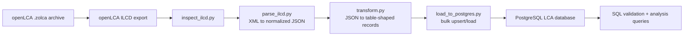

## 3. Tech Used

The project uses a focused, data-engineering-oriented stack:

| Area                 | Technology                                      |
| -------------------- | ----------------------------------------------- |
| Database             | PostgreSQL 16                                   |
| Local infrastructure | Docker Compose                                  |
| Schema               | SQL DDL, PostgreSQL enums, constraints, indexes |
| Data pipeline        | Python 3                                        |
| XML parsing          | Python `xml.etree.ElementTree`                  |
| Database loading     | `psycopg2`, `execute_values` bulk inserts       |
| Environment config   | `.env`, `python-dotenv`                         |
| Workflow automation  | Makefile                                        |
| Source data          | ELCD 3.2 from openLCA Nexus                     |
| Source format        | openLCA `.zolca`, exported to ILCD XML          |
| Query layer          | Standalone analytical SQL files                 |
| Documentation        | README files, schema docs, DBML/PDF ER diagram  |

The database is initialized automatically by Docker Compose using the SQL files mounted into `/docker-entrypoint-initdb.d`.

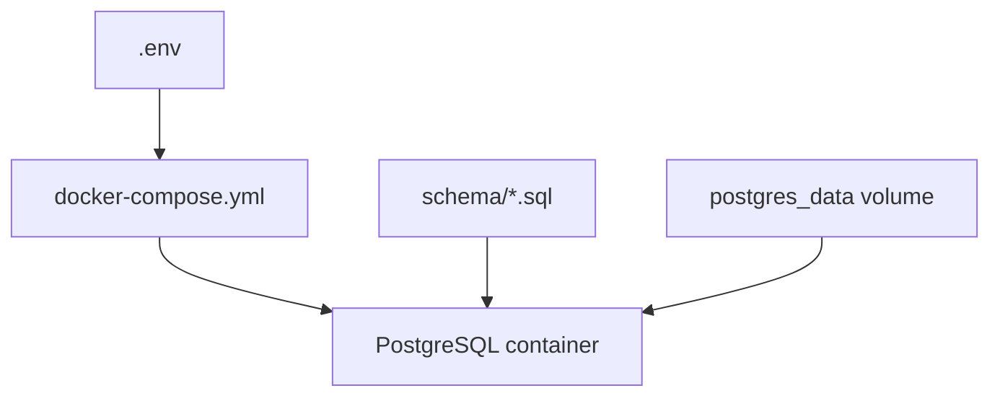

## 4. Implementation Details Visually Explained

### Core Data Model

The schema is centered around `processes`, `flows`, and `exchanges`.

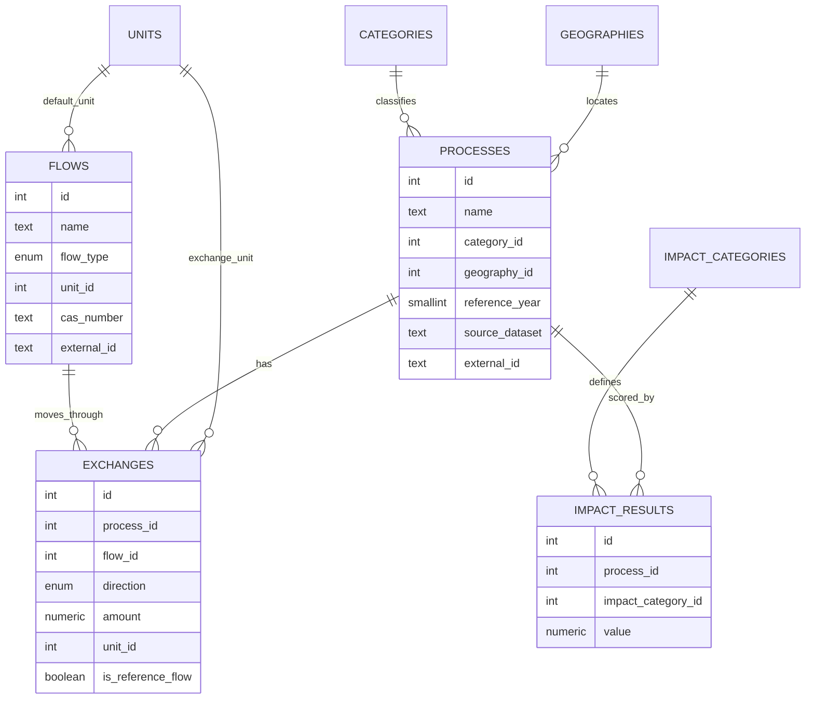

### Flow Types

The schema distinguishes between three kinds of flows:

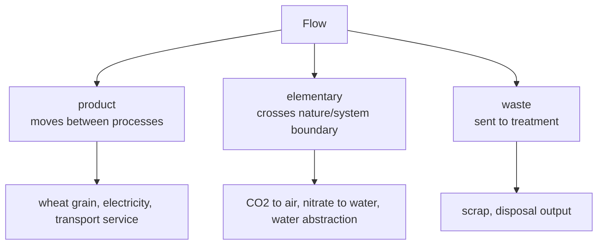

The distinction is important because product flows let the database walk upstream supply chains, while elementary flows are the environmental inventory outputs that feed impact assessment.

### Exchange Direction

Each exchange says whether a process consumes or produces a flow.

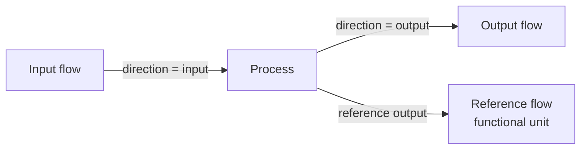

For example:

| Process       | Direction | Flow        | Meaning                      |
| ------------- | --------- | ----------- | ---------------------------- |
| Flour milling | input     | wheat grain | wheat consumed by the mill   |
| Flour milling | output    | wheat flour | product produced by the mill |
| Flour milling | output    | CO2         | emission from the process    |

### Data Pipeline

The ELCD pipeline is split into stages so each step has a narrow responsibility.

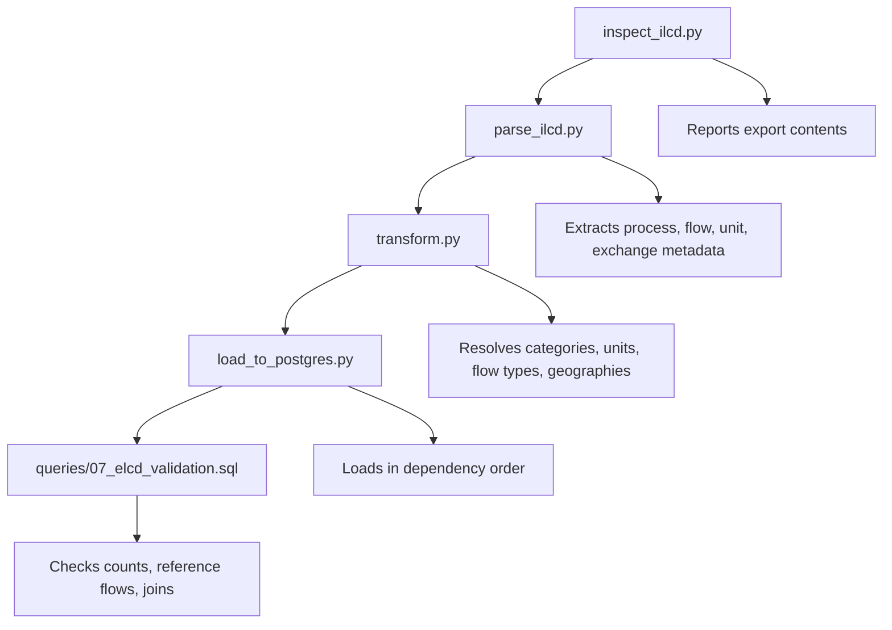

The loader inserts records in dependency order:

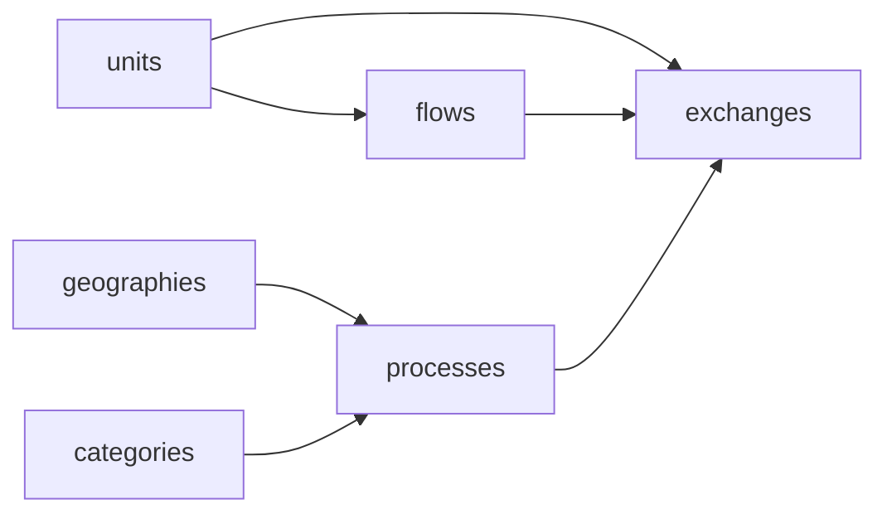

The load step is designed to be rerunnable. It upserts stable entities like geographies, units, flows, and processes, then replaces exchange rows for the loaded processes so repeated runs do not duplicate graph edges.

### Integrity Rules

The schema includes constraints that keep the graph valid:

| Rule                                      | Purpose                                                     |
| ----------------------------------------- | ----------------------------------------------------------- |
| `flow_type_enum`                          | restricts flows to `product`, `elementary`, or `waste`      |
| `direction_enum`                          | restricts exchanges to `input` or `output`                  |
| nonzero exchange amount                   | avoids meaningless graph edges                              |
| reference flow must be output             | prevents an input from defining the process output          |
| one reference flow per process            | ensures each process has at most one functional-unit output |
| unique impact result per process/category | prevents duplicate LCIA scores                              |

### Analytical Query Layer

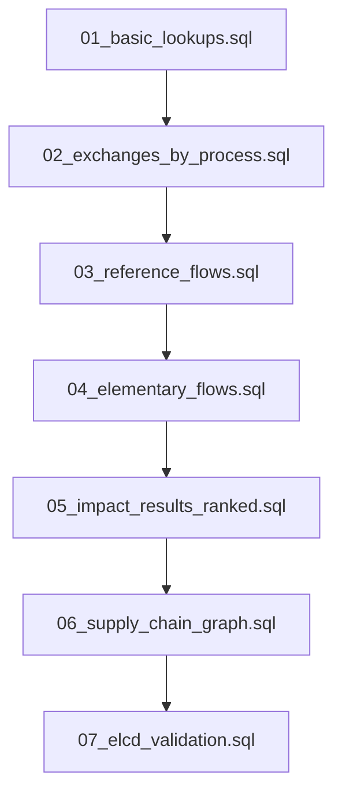

The centerpiece is the recursive supply-chain query. It starts from a process, finds its product inputs, then finds upstream processes whose reference outputs match those inputs.

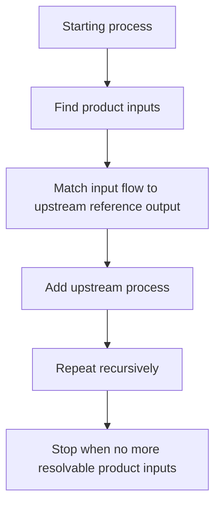

## Current State

The project includes:

- A normalized PostgreSQL schema for LCA inventory data.
- Docker-based local database setup.
- Seed data for local testing.
- A Python ELCD 3.2 parsing, transformation, and loading pipeline.
- SQL queries for validation, inventory inspection, impact ranking, and recursive supply-chain traversal.
- Documentation for schema design and data sources.
````
