# Project Overview

The **LCA Supply Chain Database** is a PostgreSQL-based data system for modelling product life cycles using Life Cycle Assessment data. It represents industrial supply chains as a graph of processes, flows, and exchanges, then layers environmental impact results on top so users can query how materials, emissions, resources, and impacts move through a product system.

The project currently supports local seed data and an ELCD 3.2 ingestion pipeline using an openLCA ILCD export.

## 1. Problem Statement

Life Cycle Assessment data is complex because it describes not just individual products, but entire chains of industrial activity.

A single product, such as wheat flour, depends on many upstream processes:

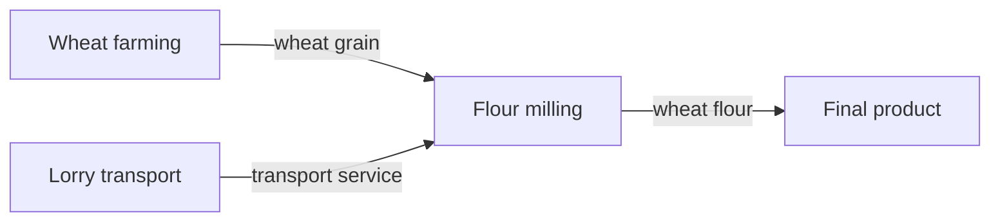

Each process consumes inputs, produces outputs, and may emit substances to air, water, or soil. Traditional flat files or ad hoc spreadsheets make it difficult to answer questions like:

- What are all the inputs and outputs for a process?
- Which upstream processes supply a product input?
- Which emissions cross the boundary between industry and nature?
- What is the cradle-to-gate inventory for a product?
- Which processes contribute most to climate change, acidification, or energy demand?
- Can real external LCA datasets be loaded into a queryable relational model?

The central problem is that LCA data is both **relational** and **graph-like**. Processes connect to flows, flows connect processes to other processes, and elementary flows connect the industrial system to the environment. The project solves this by giving that structure a clean database model and a repeatable data pipeline.

## 2. How The Project Solves the Problem

The project models a life cycle inventory as a graph inside PostgreSQL.

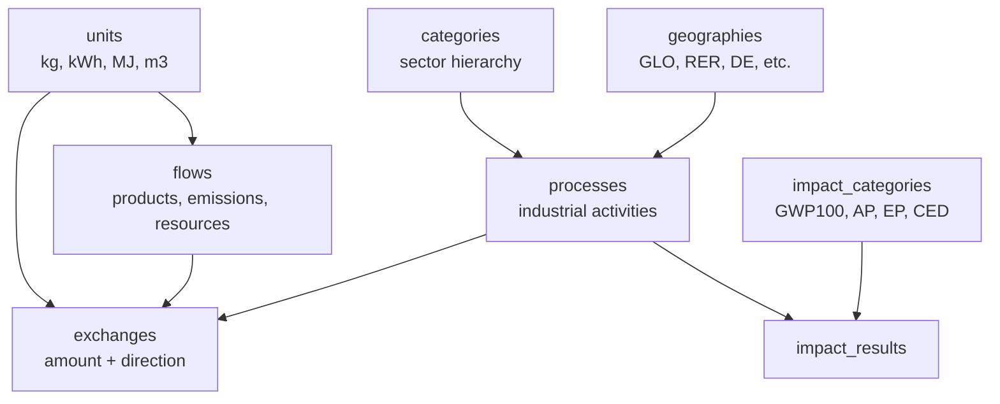

The key idea is:

- **Processes are nodes**: farming, transport, milling, electricity generation, chemical production.
- **Flows are things that move**: wheat grain, electricity, CO2, ammonia, water, waste.
- **Exchanges are edges**: a process consumes or produces a flow in a specific amount.
- **Reference flows define the functional unit**: for example, "1 kg wheat flour" is the main output that other amounts are relative to.
- **Impact results store environmental scores**: pre-calculated LCIA values per process and impact category.

This structure allows both ordinary SQL joins and graph-style recursive queries. For example, a query can start at flour milling, find all product inputs, resolve which upstream process supplies each product, and recursively walk the supply chain.

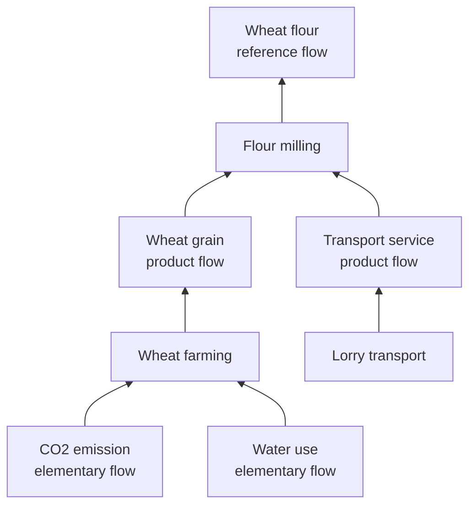

The project also includes a real-data ingestion pipeline for ELCD 3.2:

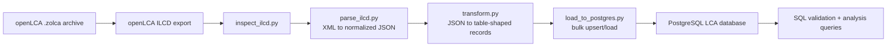

## 3. Tech Used

The project uses a focused, data-engineering-oriented stack:

| Area                 | Technology                                      |
| -------------------- | ----------------------------------------------- |
| Database             | PostgreSQL 16                                   |
| Local infrastructure | Docker Compose                                  |
| Schema               | SQL DDL, PostgreSQL enums, constraints, indexes |
| Data pipeline        | Python 3                                        |
| XML parsing          | Python `xml.etree.ElementTree`                  |
| Database loading     | `psycopg2`, `execute_values` bulk inserts       |
| Environment config   | `.env`, `python-dotenv`                         |
| Workflow automation  | Makefile                                        |
| Source data          | ELCD 3.2 from openLCA Nexus                     |
| Source format        | openLCA `.zolca`, exported to ILCD XML          |
| Query layer          | Standalone analytical SQL files                 |
| Documentation        | README files, schema docs, DBML/PDF ER diagram  |

The database is initialized automatically by Docker Compose using the SQL files mounted into `/docker-entrypoint-initdb.d`.

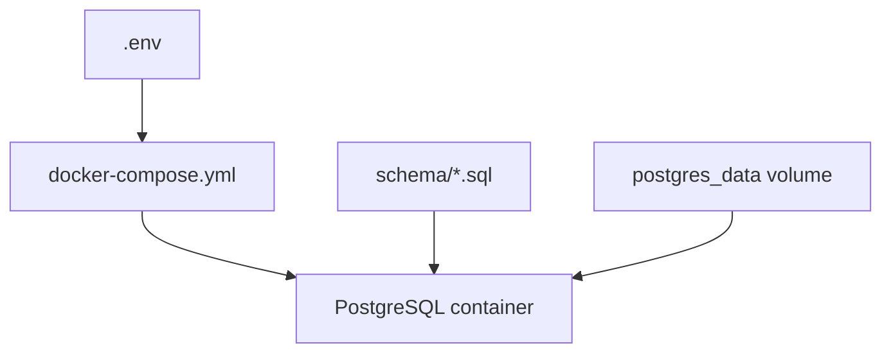

## 4. Implementation Details Visually Explained

### Core Data Model

The schema is centered around `processes`, `flows`, and `exchanges`.

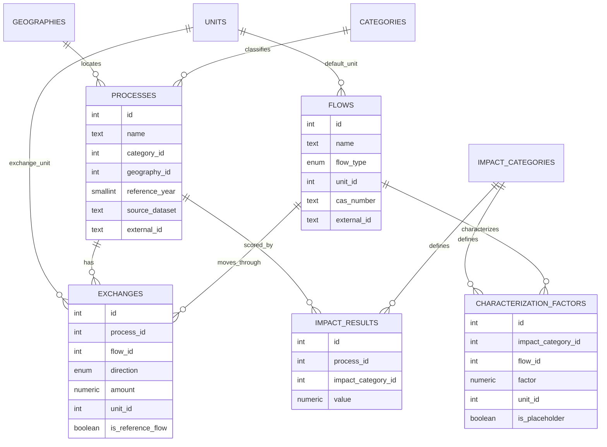

### Flow Types

The schema distinguishes between three kinds of flows:

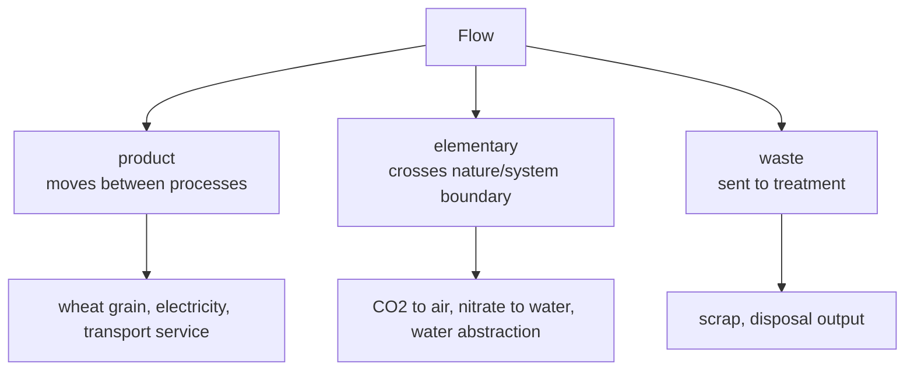

The distinction is important because product flows let the database walk upstream supply chains, while elementary flows are the environmental inventory outputs that feed impact assessment.

### Exchange Direction

Each exchange says whether a process consumes or produces a flow.

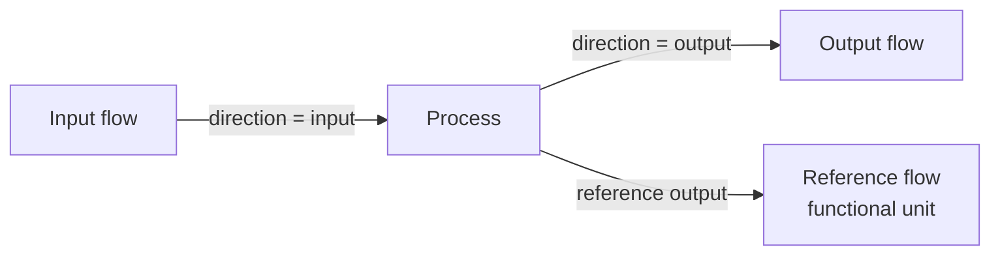

For example:

| Process       | Direction | Flow        | Meaning                      |
| ------------- | --------- | ----------- | ---------------------------- |
| Flour milling | input     | wheat grain | wheat consumed by the mill   |
| Flour milling | output    | wheat flour | product produced by the mill |
| Flour milling | output    | CO2         | emission from the process    |

### Data Pipeline

The ELCD pipeline is split into stages so each step has a narrow responsibility.

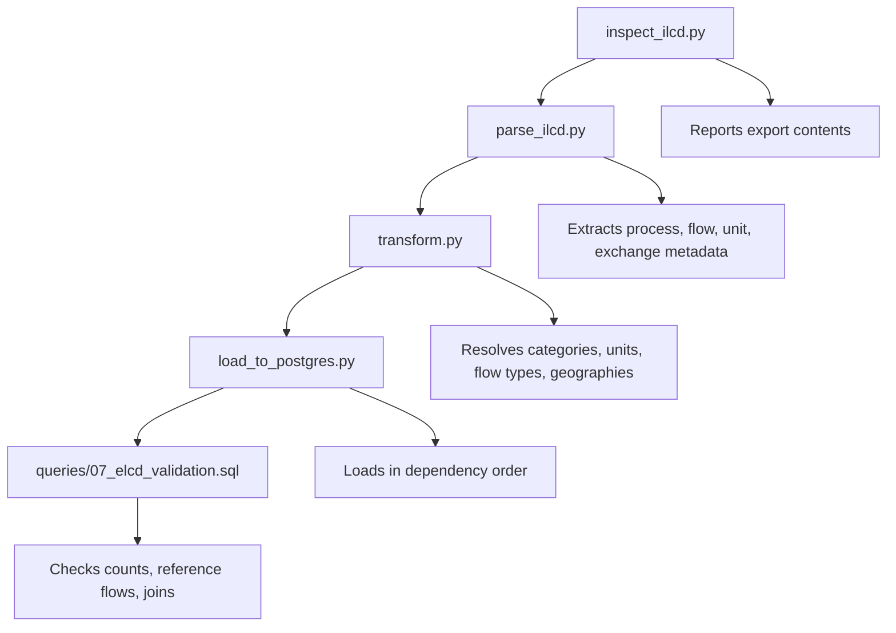

The loader inserts records in dependency order:

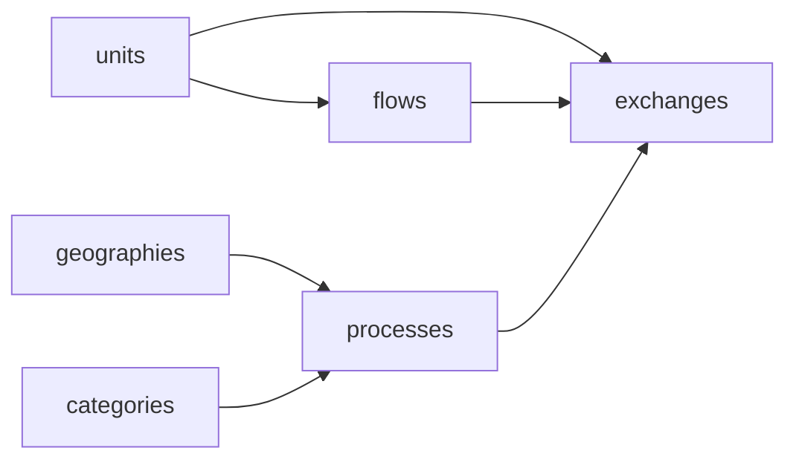

The load step is designed to be rerunnable. It upserts stable entities like geographies, units, flows, and processes, then replaces exchange rows for the loaded processes so repeated runs do not duplicate graph edges.

### Integrity Rules

The schema includes constraints that keep the graph valid:

| Rule                                      | Purpose                                                     |
| ----------------------------------------- | ----------------------------------------------------------- |
| `flow_type_enum`                          | restricts flows to `product`, `elementary`, or `waste`      |
| `direction_enum`                          | restricts exchanges to `input` or `output`                  |
| nonzero exchange amount                   | avoids meaningless graph edges                              |
| reference flow must be output             | prevents an input from defining the process output          |
| one reference flow per process            | ensures each process has at most one functional-unit output |
| unique impact result per process/category | prevents duplicate LCIA scores                              |

### Analytical Query Layer

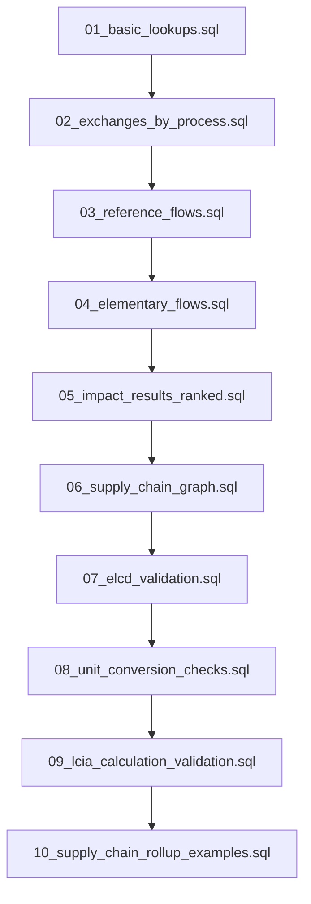

The centerpiece is the recursive supply-chain query. It starts from a process, finds its product inputs, then finds upstream processes whose reference outputs match those inputs.

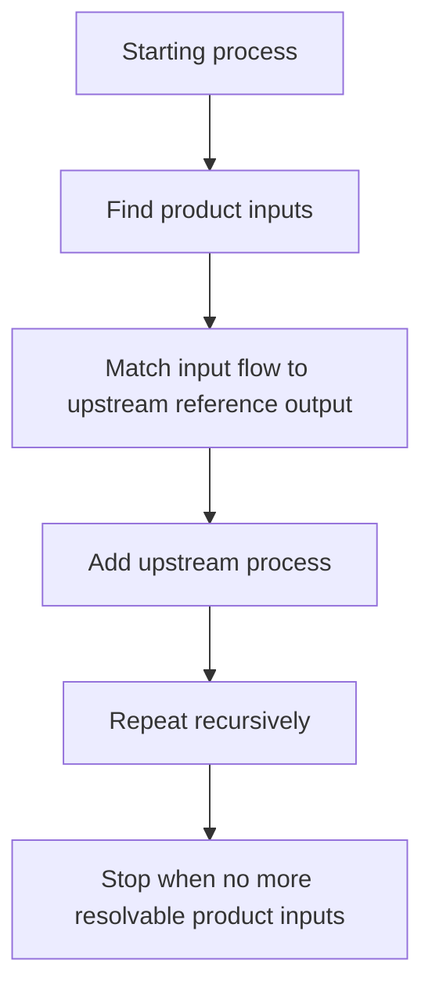

### LCIA Calculation Engine

`impact_results` no longer has to be typed by hand. `characterization_factors` (one row per elementary flow per impact category) plus a small set of SQL functions derive impact scores directly from exchanges:

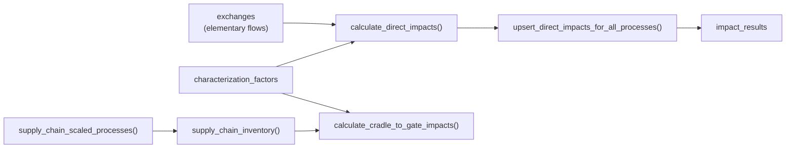

`calculate_direct_impacts(process_id)` characterizes one process's own exchanges. `supply_chain_scaled_processes()` generalizes the recursive traversal above into a parameterized function with automatically computed scaling factors and cycle-safe termination (visited-process-id guard + depth cap); `supply_chain_inventory()` aggregates the scaled elementary flows across the whole upstream chain; `calculate_cradle_to_gate_impacts()` runs that inventory through the same characterization logic to score an entire cradle-to-gate system in one call.

Only a handful of real, cited characterization factors are seeded (enough to validate the engine against the wheat-flour example) — see `schema/04_characterization_factors.sql` for exactly what's covered and where real factors for the rest of the ELCD-loaded flows should come from.

### Unit Conversion

`convert_amount(amount, from_unit_id, to_unit_id)` converts between units that share a conversion group (`units.unit_group_external_id`), or returns `NULL` for anything incompatible or unmodeled — never a wrong number. The calculation engine and the rollup both use it wherever an exchange's unit might not match the unit they need. `v_exchange_unit_flags` flags every exchange's unit against its flow's default unit for review (`queries/08_unit_conversion_checks.sql`).

## 5. Development Journey

This project was built in stages, each one deliberately gated on the previous one being solid — a dashboard (or a calculation) built on top of wrong numbers is worse than no dashboard at all. It was developed collaboratively with Claude (Anthropic) acting as a pair-programmer/agent: reading and writing the SQL and Python directly, researching real characterization factors, and running verification against the actual project files. The sections below are the honest version of how it went, including the parts that didn't work the first time.

**1. Schema and mental model first.** Before any pipeline or calculation code, the project settled on the core invariants that everything else depends on: processes are graph nodes, flows are typed (`product` / `elementary` / `waste`), exchanges are directed edges, and a process's reference flow defines its functional unit. These are enforced at the database level (constraints, partial unique indexes) rather than just in application code, and a `CLAUDE.md` file was written up front to record them explicitly as invariants that later work must not silently weaken.

**2. Real data, not just a toy example.** The wheat-flour seed data was always meant to be a hand-checkable example, not the whole story — the ELCD 3.2 ingestion pipeline (`inspect → parse → transform → load`) exists so the schema has to survive contact with a real 608-process, 212k-exchange dataset, not just three illustrative processes.

**3. The float bug.** While working through the numeric-precision item on the roadmap, `parse_ilcd.py` turned out to be routing every ELCD amount through Python's `float()` before it ever reached the database — despite the column being `NUMERIC(60, 50)` specifically to hold LCA-scale values like `5.38063410297918E-17`. This is easy to miss because Python's `repr()` often prints back the same digits you started with. The actual test that proved the bug was real: expand the float's _exact_ binary value to 25 significant digits (`"%.25g" % f`) and compare it to the source text — for that value, they diverge at the 17th digit. The fix carries amounts as validated strings from parsing through transformation, and only converts to `Decimal` immediately before the database write, with a guard that raises loudly if a `float` ever reappears in that path instead of silently rounding it away.

**4. Characterization factors: research over invention.** The LCIA calculation engine needed real characterization factors, not made-up ones. Sourcing them turned into actual research rather than a lookup: a web search for CML 2002 acidification factors for ammonia turned up two different secondary-source numbers (1.6 vs 1.88 kg SO2-eq/kg) with no way to verify which was right. Rather than pick one and hope, the project fetched the EU Joint Research Centre's own primary-source PDF on ILCD-recommended LCIA methods, found a fully-derived table with a clear citation trail, and used that method (a different one — "Accumulated Exceedance" — with a different unit) instead. It was added as a new, separately-labeled impact category rather than mixed into the existing CML category under a name that wouldn't match. The categories with no verified factor (nitrate eutrophication, cumulative energy demand) were left uncharacterized on purpose, with notes on exactly where real values should come from, rather than filled in with guesses.

**5. Unit conversion: the trap of the obvious design.** The first instinct for "can these two units convert into each other" was to compare the existing `dimension` column (`mass`, `energy`, ...). That turns out to be unsafe: `dimension` is just a best-effort label inferred from unit group names, so two unrelated unit groups could coincidentally get the same label without sharing a real reference point. Reading the actual ELCD unit-group XML settled it — each unit group has one true reference unit, and every other unit's `meanValue` is its conversion factor _to that specific group's reference unit_. The schema now tracks that real compatibility key (`unit_group_external_id`) separately from the descriptive label, and `convert_amount()` only ever converts within a group, returning `NULL` (never a wrong number) for anything else.

**6. Generalizing the rollup.** The recursive supply-chain query started as a hand-written example with manually typed scaling factors for exactly one process. Generalizing it into a parameterized function meant working out the actual scaling formula from the schema's own semantics (every exchange amount is already "per one unit of the process's reference flow," so the scale factor is just the required input amount divided by the upstream's reference amount, compounding down the chain) and adding a visited-process-id guard plus a depth cap so it can't loop forever on a graph that might not be a tree.

**7. Verifying SQL without a database.** Docker wasn't reachable during a chunk of this work, which made "run it and see" impossible for the new SQL. Two independent checks stood in for that: `pglast` (a real Python binding to PostgreSQL's own query parser, `libpg_query`) syntax-checked every file against actual PostgreSQL grammar — and caught a genuine bug this way, a stray `/*` inside a file-path comment (`unitgroups/*.xml`) that Postgres's _nestable_ comment syntax interpreted as opening a second, unclosed comment, swallowing the rest of the file. Separately, a from-scratch Python re-implementation of the expected arithmetic (no SQL, no imports of the actual engine — just the same numbers computed independently) gave a second source of truth to compare the SQL's logic against once a database was available.

**8. First real run, first real gotcha.** The first time the new schema files actually ran against Docker, three of them errored with "function does not exist." The cause wasn't a SQL bug — Postgres's official image only executes `docker-entrypoint-initdb.d/*.sql` the first time a container initializes an _empty_ volume, and the existing container's volume predated the new files. Confirmed by noticing the one query that _did_ succeed was returning the old hand-typed seed values, not newly-computed ones — meaning the container was still running the pre-existing schema. `make reset` (which recreates the volume from scratch) fixed it, which is exactly the kind of thing that's obvious once you've seen it and easy to lose an hour to the first time.

## Current State

The project includes:

- A normalized PostgreSQL schema for LCA inventory data.
- Docker-based local database setup.
- Seed data for local testing.
- A Python ELCD 3.2 parsing, transformation, and loading pipeline. Amounts are carried as validated strings/`Decimal` end-to-end (never `float`) to preserve the precision of LCA-scale values; `loader/check_precision.py` (`make check-precision`) is a regression check that a known tiny ELCD amount round-trips exactly.
- An LCIA calculation engine (`characterization_factors` + `calculate_direct_impacts()` / `calculate_cradle_to_gate_impacts()`) that derives `impact_results` from exchanges instead of requiring hand-typed values.
- A unit conversion engine (`convert_amount()`, `v_exchange_unit_flags`) used by the calculation engine and the rollup wherever units might not already match.
- A generic, parameterized recursive supply-chain rollup (`supply_chain_scaled_processes()` / `supply_chain_inventory()`) with automatic scaling and cycle-safe traversal.
- SQL queries for validation, inventory inspection, impact ranking, and recursive supply-chain traversal.
- Documentation for schema design and data sources.
