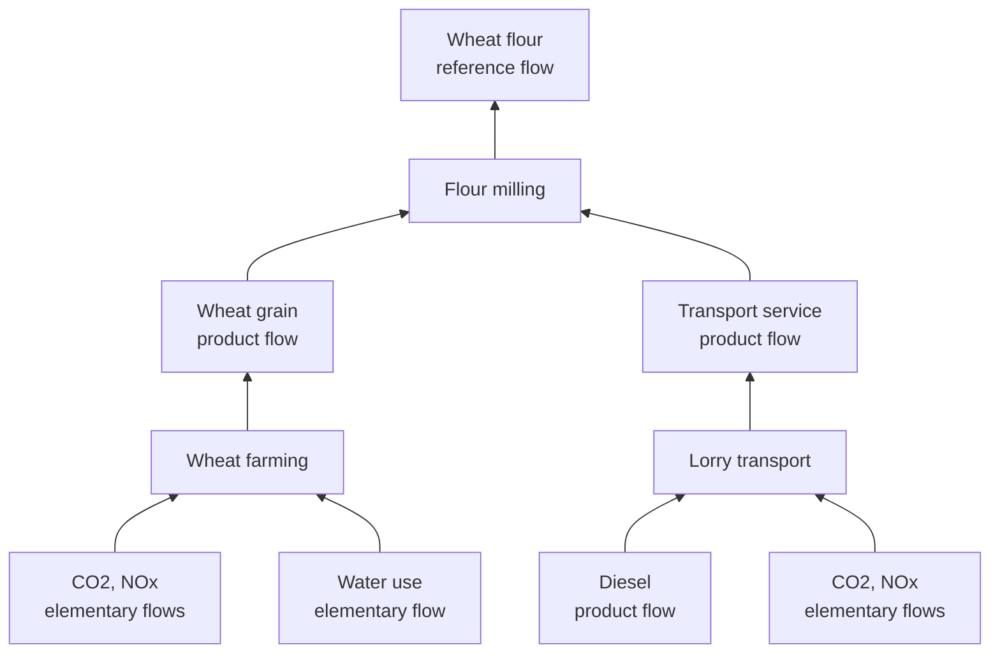

# Project Overview

A postgreSQL database for life cycle assessment (LCA) data. It stores industrial processes and the flows between them as a graph, so you can trace a product back through its supply chain and calculate the environmental impact of the whole chain.

Runs locally with Docker. Ships with a small hand-checkable seed dataset (wheat flour, 3 processes) and a pipeline that loads ELCD 3.2 from an openLCA ICLD export – 608 processes and 212,170 exchanges.

You can find the datasources in \docs in the repo.

## 1. Problem Statement

LCA data does not fit a flat table. A kilo of wheat flour is not one number; it is the sum of everything upstream of the mill (growing the wheat, hauling it, and running the machinery) and each one of those steps consumes inputs, produces outputs, and emits something to air, water and/or soil.

That structure is relational and graph-like at the same time. Processes have attributes and belong to categories, which is ordinaru relational data. But processes also connect to each other through the flows they exchange, and answering anything useful means walking those connections: which processes supplies this input, and what supplies that one, and so on until you reach raw material extraction.

The goal is to hold both a relational schema that enforces the rules LCA data has to follow, with recursive queries on top fro the traversal.

## How it works

The data is a graph inside PostgreSQL. Processes are the nodes (farming, milling, transport, electricity generation, ...). Flows are what move between them: wheat grain, electricity, CO2, water. Exchanges are the edges, each one saying that a process consumes or produces a given amount of a given flow.

One output per process is marked as its reference flow. That is the functional unit ("1kg wheat flour") and every other amount on that process is relative to it. It is what makes the graph traversible: to find what supplies an input, look for the process whose reference flow is that same flow.



Ordinary joins answer the relational questions ("what does this process emit, which processes are in this category?"). Recursive queries answer the graph ones: start at the mill, walk upstream until you reach raw materials, and add up the emissions along the way.

## Stack

PostgreSQL 16, running locally in Docker. Schema is a plain SQL DDL with enums, constraints and indexes.
The pipeline is Python 3: 'xml.etree.ElementTree' for the ILCD XML, 'psycopg2' with 'excecute_values' for bulk loading. Analysis is standalone SQL files, and 'make' wraps the whole thing.

Data is ELCD 3.2 from openLCA Nexus (see docs)

## Running it

```bash
cp .env.example .env
make reset # start postgres, run schema/*.sql
make pipeline # load ELCD 3.2
```

## Design decisions

A postgreSQL schema where the LCA rules are constraints, not conventions: flows are typed, exchanges are directed, and a process can have at most one reference output.

A Python pipeline that loads ELCD 3.2 (inspect, parse, transform, load) carrying amounts as strings and 'Decimal' end to end. LCA values go down to 1e-17, and 'float' silently rounds them away. 'make-check-precision' is the regression test.

A calculation engine that derives impacts from exchanges rather than hand-typed numbers. `calculate_direct_impacts()` scores one process; `supply_chain_scaled_processes()` walks upstream with automatic scaling and a cycle guard, and `calculate_cradle_to_gate_impacts()` scores the whole chain.

Unit conversion that returns `NULL` rather than a wrong number when two units are not compatible.

Analysis queries in `queries/`, and an independent Python reimplemntation of the seed arithmetic (`make validate-lcia-seed`) as secound source of truth.
